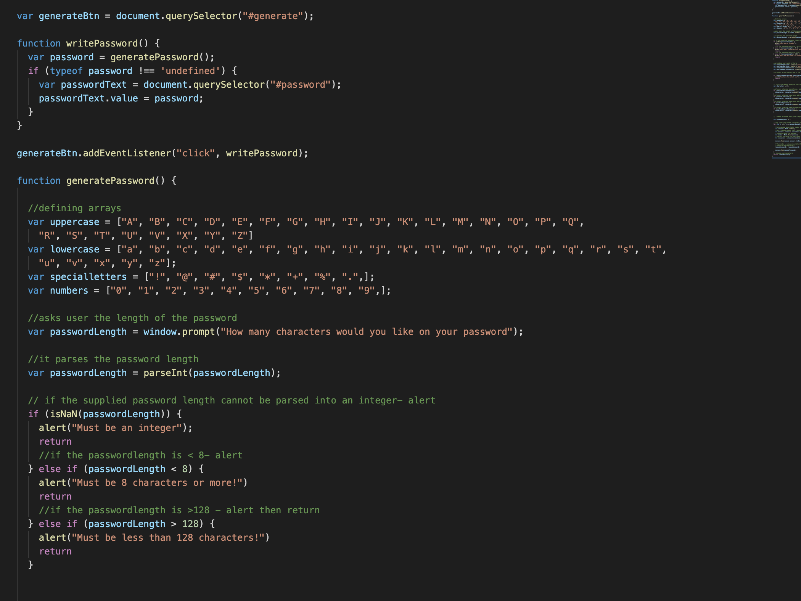
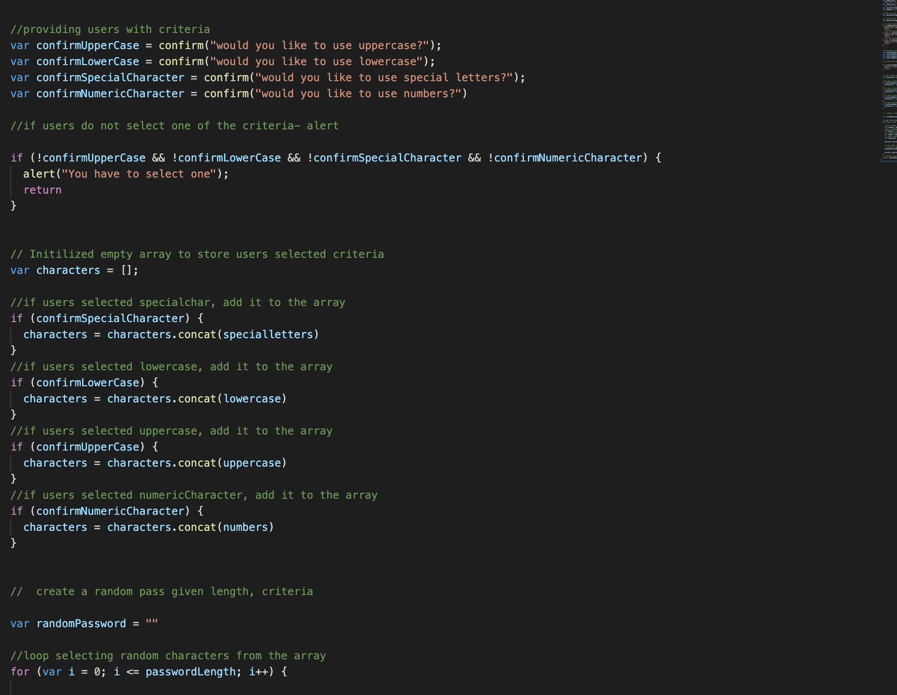
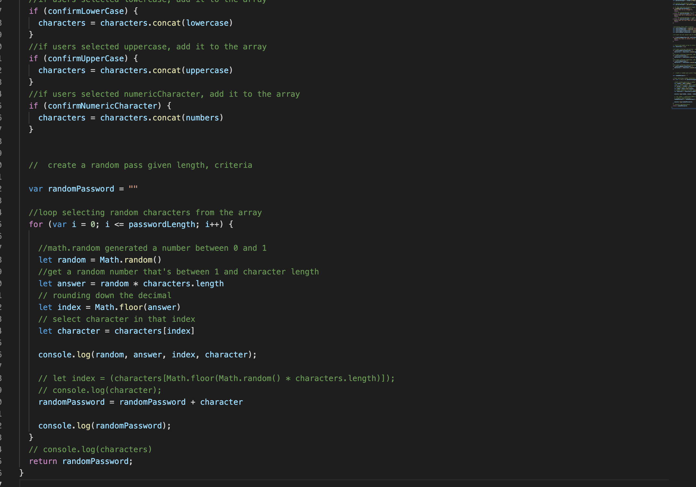

# password-generator

***The README must contain at minimum
 a description of what the project is, 
 technologies used, 
 screenshots of essential code, 
 and gif walkthroughs of the application functioning. 
 
# Description
    This app was a UCB boot camp homework assignment. It generated a random password based on 4 criterias. If it does not meet the creteria, then it tells the user they must select one to try again. It requires the password be no less than 8 and no more than 120 characters. 

# technologies used 
    HTML, CSS, JS. 

# screenshots

 
 

# gif walkthroughs
[Alt text](assets/img/password-generator.gif)

# Contributors
UCB bootcamp
Classmates on Discord Channel 
Divesh Rizal (my brother)

# license 
MIT

